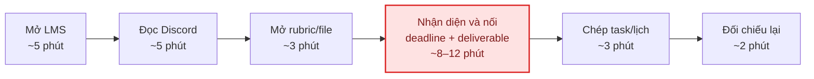
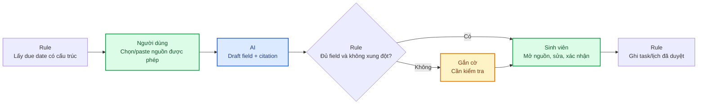
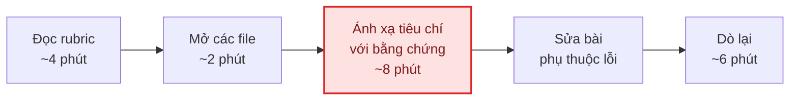
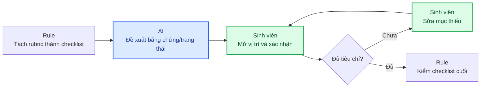
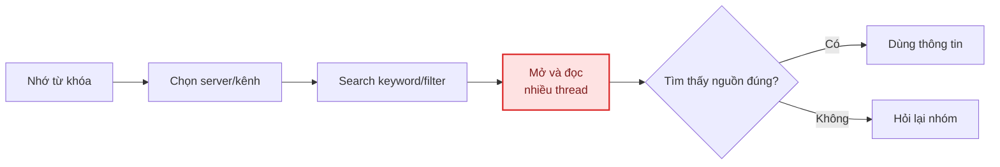
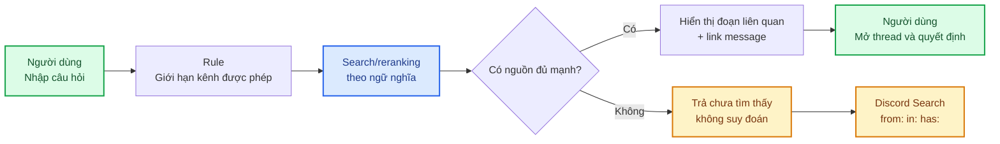

# Draft workflows — Top 3 Problem Cards

**Học viên:** Nguyễn Đức Anh — 2A202601063

> Các con số thời gian là ước lượng hồi tưởng dùng để xác định điểm cần đo, không phải baseline đã kiểm chứng.

## Card #1 — Gom yêu cầu và deadline

### Current state

**Bottleneck:** Nhận diện và nối các field của cùng một bài từ nhiều nguồn.

### Future state

**Human boundary:** Sinh viên xác nhận từng record trước khi ghi lịch.  
**Fallback:** Thiếu nguồn, xung đột hoặc AI lỗi → checklist thủ công; không tự tạo deadline.

---

## Card #2 — Kiểm tra bài nộp theo rubric

### Current state

**Bottleneck:** Ánh xạ từng tiêu chí trong rubric với vị trí bằng chứng trong bài.

### Future state

**Human boundary:** AI không tự chấm điểm; sinh viên xác nhận bằng chứng và nội dung sửa.  
**Fallback:** AI không tìm thấy không đồng nghĩa bài thiếu; quay về checklist thủ công.

---

## Card #3 — Tìm quyết định cũ trong Discord

### Current state

**Bottleneck:** Phải đọc nhiều thread vì từ khóa không khớp cách diễn đạt trong tin nhắn.

### Future state

**Human boundary:** Người dùng phải mở tin nhắn gốc và tự quyết định thông tin còn hiệu lực hay không.  
**Fallback:** Không có nguồn đủ mạnh → nói chưa tìm thấy và dùng Discord Search có sẵn.

## Chú giải

| Màu | Ý nghĩa |
|---|---|
| Đỏ | Bottleneck hiện tại |
| Xanh lá | Bước con người chịu trách nhiệm |
| Xanh dương | Bước AI hỗ trợ |
| Vàng | Fallback / case cần kiểm tra |
