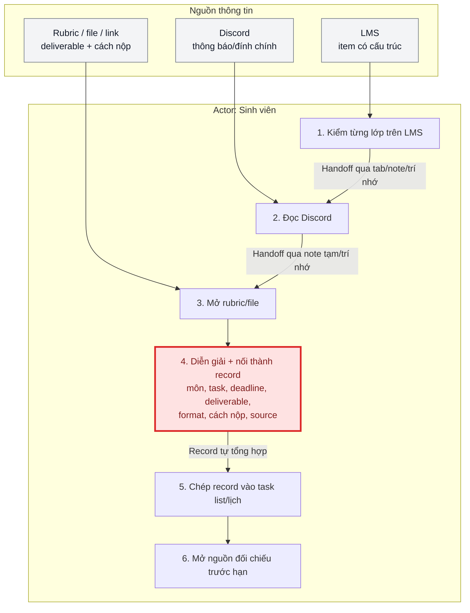
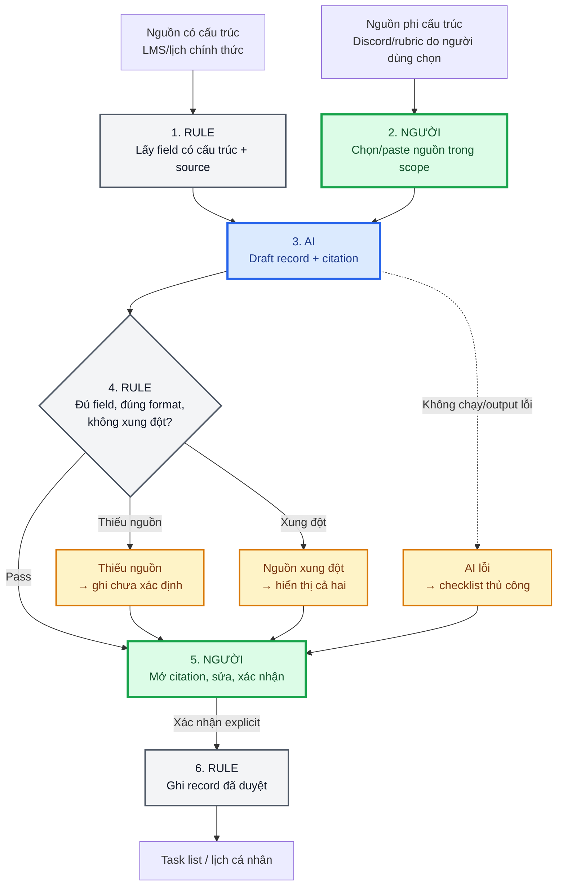
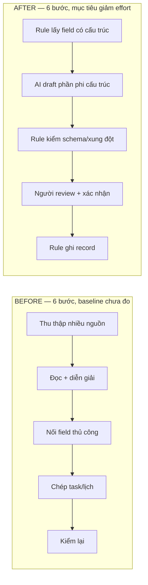
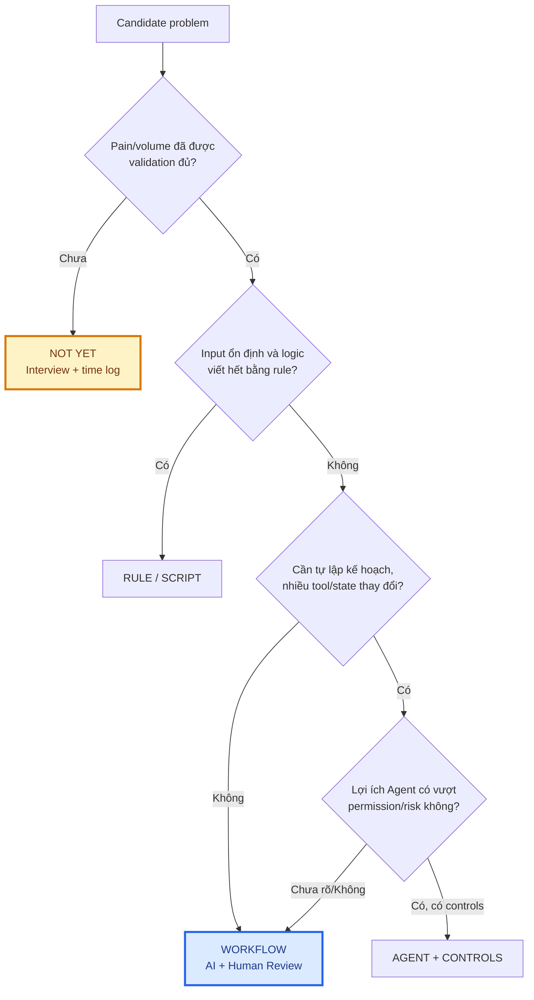
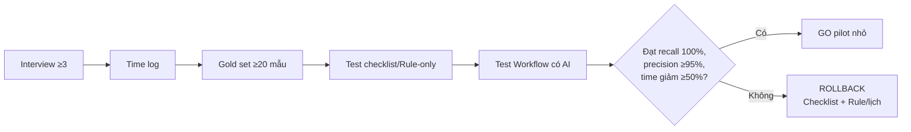

# Workflow nhóm — Before / After và Decision

**Candidate:** Gom yêu cầu và deadline bài tập từ LMS, Discord và rubric  
**Mức can thiệp đề xuất:** Workflow có AI hỗ trợ một bước + Human Review  
**Decision:** `Not Yet`

> Baseline thời gian chưa được đo. Sơ đồ mô tả actor, handoff, bottleneck, boundary và fallback; không khẳng định solution đã đạt target.

## 1. Current workflow

**Bottleneck:** Bước 4.  
**Handoff yếu nhất:** Từ nhiều nguồn/tab → trí nhớ/note tạm → record được chép thủ công.

## 2. Future workflow

### Boundary

- AI chỉ tạo draft từ nguồn đã được chọn và phải giữ citation.
- Rule không tự suy ra field thiếu hoặc tự chọn giữa hai nguồn xung đột.
- Sinh viên chịu trách nhiệm mở nguồn, sửa và xác nhận từng record.
- Không xác nhận → không ghi task/lịch.
- Không tự gửi thông báo và không tự nộp bài.

## 3. Before / after

| Metric | Before | After target |
|---|---|---|
| Tổng thời gian | Chưa đo; 20–30 phút/tuần chỉ là ước lượng | Median giảm ≥50% sau khi có baseline |
| Bước người chủ động | 6/6 | 2/6 |
| Bottleneck | Diễn giải + nối + chép | Review và xử lý ngoại lệ |
| Recall deadline/deliverable | Chưa đo | 100% |
| Precision theo field | Chưa đo | ≥95% |
| Traceability | Không bắt buộc | 100% record có source |

## 4. Cây quyết định mức can thiệp

**Kết quả hiện tại:** Solution hypothesis là `Workflow`, nhưng quyết định triển khai là `Not Yet`.

## 5. Validation gates và rollback

## Chú giải

| Màu | Ý nghĩa |
|---|---|
| Đỏ | Bottleneck |
| Xanh lá | Human boundary / bước con người |
| Xanh dương | AI hoặc lựa chọn Workflow |
| Xám | Rule / source có cấu trúc |
| Vàng | Fallback hoặc `Not Yet` |
